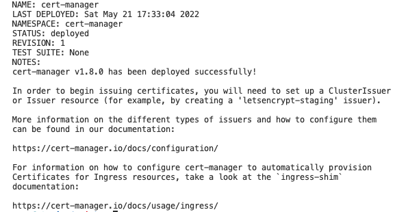
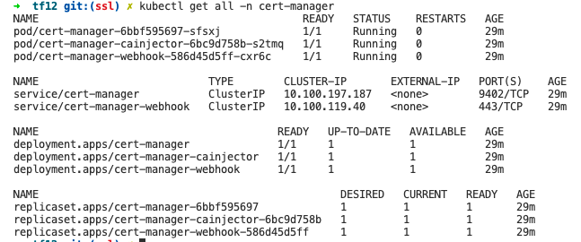
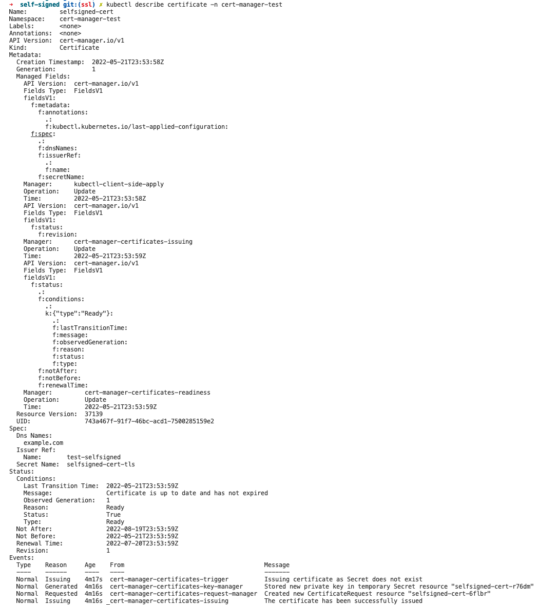

## Let's Encrypt --Overview
- Let's Encrypt is a Certificate Authority that lets you generate free, short-lived SSL certificates automatically
- to get a certificate we run the "cert bot" on our webserver--the Cert Bot "asks" Let's Encrypt for a certificate
- after a "challenge" is met, Let's Encrypt fulfills the cert request
- the process can be automated with a cron job so that the process becomes self-managed

## cert manager
- cert-manager provides Helm charts as a first-class method of installation on both Kubernetes
- Be sure never to embed cert-manager as a sub-chart of other Helm charts; 
- cert-manager manages non-namespaced resources in your cluster and care must be taken to ensure that it is installed exactly once
- cert-manager gets wired-up to a CA such as Let's Encrypt
- in the case of Let's Encrypt, we ask for a certificate using a YAML file
  + YAML file specifies domain
  + YAML file also specifies a secret where the cert will be stored
  + cert-manager will talk to the CA and place the specified cert in the corresponding Kubernetes secret
  + cert-manager will also replace the certificate with a new one when it's about to exprire
### certificate resources
- In cert-manager, the *Certificate* resource represents a human readable definition of a certificate request
- a resource request is typically sent to an issuer and is to be kept up-to-date
- This is the usual way that you will interact with cert-manager to request signed certificates
- A Certificate resource specifies fields that are used to generate certificate signing requests which are then fulfilled by the issuer type you have referenced
- Certificates specify which issuer they want to obtain the certificate from by specifying the certificate.spec.issuerRef field.
### ingress controller
- In order for the Ingress resource to work, the cluster must have an ingress controller running.
- AWS Load Balancer Controller is a controller to help manage Elastic Load Balancers for a Kubernetes cluster:
  + It satisfies Kubernetes Ingress resources by provisioning Application Load Balancers.
  + It satisfies Kubernetes Service resources by provisioning Network Load Balancers.
- AWS **Elastic Load Balancing Application Load Balancer (ALB)** is an AWS service that load balances incoming traffic at the application layer (layer 7) across multiple targets, such as Amazon EC2 instances, in multiple Availability Zones
- this project was configured with the AWS ALB ingress controller
- the AWS ingress controller is typically configured with these annotations:
    - `kubernetes.io/ingress.class: alb`
    - `alb.ingress.kubernetes.io/scheme: internet-facing`

### cert manager installation with Helm
- `helm repo add jetstack https://charts.jetstack.io`
- `helm repo update`
- cert-manager requires a number of CRD resources, which can be installed manually using kubectl, or using the installCRDs option when installing the Helm chart:
  + `kubectl apply -f https://github.com/cert-manager/cert-manager/releases/download/v1.8.0/cert-manager.crds.yaml`
  + cert manager can also be installed using the `helm` command
    + this is how it was done in our deployment:
    + `helm install cert-manager jetstack/cert-manager --namespace cert-manager --create-namespace --version v1.8.0 --set installCRDs=true`

    

- cert manager install several resources: there will be a "ca" pod, a "cainjector" pod, and a "webhhook" pod

    

### getting cert manager connected to Let's Encrypt:  https://cert-manager.io/docs/configuration/ca/#deployment
-  cert-manager uses the "ACME" issuer type when configuring for Let's Encrypt
- in order to use the ACME issuer type, the cluster has to have the ability to solve Let's Encrypt challenges
- a typical cluster has an ingress controller that accepts public traffic; the ingress controller will be used to faciliate the Let's Encrypt challenge procedure
- deploy sample app that uses the ALB ingress:  examples/alb/example-deployment.yml

#### testing wtih self-signed certs: dry run
1. create a "test" namespace: `kubectl create ns cert-manager-test`
2. `cd examples/self-signed`
3. `kubectl apply -f issuer.yml`
4. `kubectl apply -f certifcate.yml`
5. `kubectl describe certifcate -n cert-manager-test`

    

6. to view the certificate, **list the secrets in that namespace:** (remember , SSL certs are stored as kubernetes secrets)
  + `kubectl get secrets -n cert-manager-test`

## Links
https://www.youtube.com/watch?v=hoLUigg4V18&t=121s
https://www.youtube.com/watch?v=HzxjsMrtIwc
https://www.youtube.com/watch?v=7m4_kZOObzw 
https://github.com/cert-manager/cert-manager
https://cert-manager.io/v0.14-docs/installation/kubernetes/ 

https://myhightech.org/posts/20210402-cert-manager-on-eks/ 
https://github.com/antonputra/tutorials/tree/main/lessons/083 
https://aws.amazon.com/premiumsupport/knowledge-center/terminate-https-traffic-eks-acm/ 
https://cert-manager.io/docs/installation/helm/ 
https://www.howtogeek.com/devops/how-to-install-kubernetes-cert-manager-and-configure-lets-encrypt/ 
https://github.com/kubernetes-sigs/external-dns/blob/master/docs/tutorials/aws.md
https://stackoverflow.com/questions/62919880/eks-route53istio-gateway-cert-manager-letsencrypt
https://aws.amazon.com/blogs/containers/securing-eks-ingress-contour-lets-encrypt-gitops/